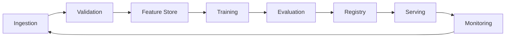

# Pipeline Components Diagram

```mermaid
flowchart LR
    A[Ingestion] --> B[Validation]
    B --> C[Feature Store]
    C --> D[Training]
    D --> E[Evaluation]
    E --> F[Registry]
    F --> G[Serving]
    G --> H[Monitoring]
    H --> A
```

## Notes
- Ingestion can be batch or streaming
- Validation includes schema checks and data drift signals
- Registry stores approved model artifacts and metadata
